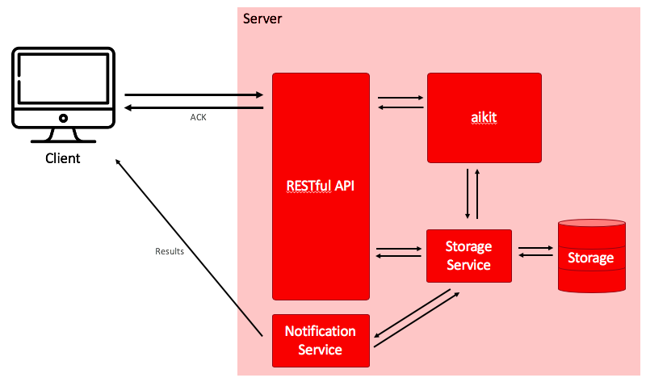

# documentation_aikit_internship
Documentation to improve aikit
(https://github.com/societe-generale/aikit)


# Introduction
Currently, aikit proposes an Excel file to display automl results.
A client could be realised for a better visualization. There are few ways to achieve this.
- The first and easiest one would be to develop a client that embbed aikit. This solution requieres that the hosting machine needs high performances.
- Another solution would be to develop a client that reaches aikit through an API. This implies high performances on server side.


# Presentation

We present here the second solution with an API.
Therefore, a RESTFULL API with flask in Python could be created as following architecture to simplify the usage of aikit :




## Server Side

### Flask API

Flask provides RESTFULL API in Python. Flask is easy to get started and requires only mainly a reliable install. Because Flask is in Python, we could launch other scripts in Python as aikit.
(https://flask.palletsprojects.com/en/1.1.x/)


### Storage

Aikit results are in 2 file formats:
- JSON for the model which fits the problem
- CSV for the score obtained by the model

To store aikit results, different technologies could be relevant. I present here two possible choices: either MongoDB or Microsoft SQL Server.

#### MongoDB

MongoDB is a document-oriented data store. It uses JSON-like documents with optional schemas. Data is stored in a Binary Object Notation (BSON) storage format.
(https://www.mongodb.com)

It supports multi-languages and especially Python, the language used for this project. PyMongo is a commonly used client for interfacing with one or more MongoDB instances through Python code.

Also, MongoDB could be a good start for large-scale deployments. MongoDB is designed to efficiently handle Big Data. MongoDB can run over multiple servers, balancing the load or duplicating data to keep the system up and running in case of hardware failure.
Furthermore, MongoDB is optimised with some distributed cluster-computing services as Spark.

But, the file storage is not well supported by MongoDB. So, to store the aikit results which are CSV format, we should use an auxiliary JSON model such as:

```JSON
{
	"id": "9cbb243a-6400-46ba-add0-524d60065c1f",
	"executionTime": 1.345,
	"date": "2020-06-05",
	"aikit_model": { "..."
	},
	"result": {
		"column": ["test_accuracy", "test_log_loss_patched", "test_avg_roc_auc", "test_f1_macro", "train_accuracy", "train_log_loss_patched", "train_avg_roc_auc", "train_f1_macro", "fit_time", "score_time", "n_test_samples", "fold_nb"],
		"row": [
		{
			"values": [0.9904761904761905,	-0.45931387893427056,	0.9984756097560976,	0.9899511915015791,	0.9745493107104984,	-0.4667526620337411,	0.9938859144689007,	0.9731810209982462,	0.045392751693725586,	0.03303408622741699,	105,	0]
      
		},
		{
			"values": [0.9619047619047619,	-0.47757059197874785,	0.9649390243902439,	0.9592074592074593,	0.9777306468716861,	-0.46388441774535133,	0.9953825670660887,	0.9765686287270054,	0.04618477821350098,	0.03585314750671387,	105,	1]
		}]
	}
}
```

#### Microsoft SQL Server

An other solution to store the results in CSV format is to use a storage file system as Microsoft SQL Server.
(https://docs.microsoft.com/sharepoint/administration/sql-server-and-storage)

Microsoft SQL Server is a relational database management system. If the file size is less than 256 Ko, Microsoft SQL Server stores directly the CSV file as one binary row in the SQL database. Otherwise, the file is stored as a BLOB, which means in a file storage, and referenced in the SQL database. BLOB has fast access to the named file and there is no conversion cost.

Microsoft SQL Server is heavier to deploy than MongoDB.
Hosted on Azure Server this storage system is more efficient.


### Storage Service

The storage service is the interface of the database.


### Notification Service

A notification service could be develop in order to inform the client of progress of the aikit run.

It could be possible to handle the STOP conditions:
- time condition
- score condition


## Client Side

The client side could offer few services as:
- to create a dataset
- to get result of aikit run
- to subscribe a token to have notifications and follow the progress of aikit run.
