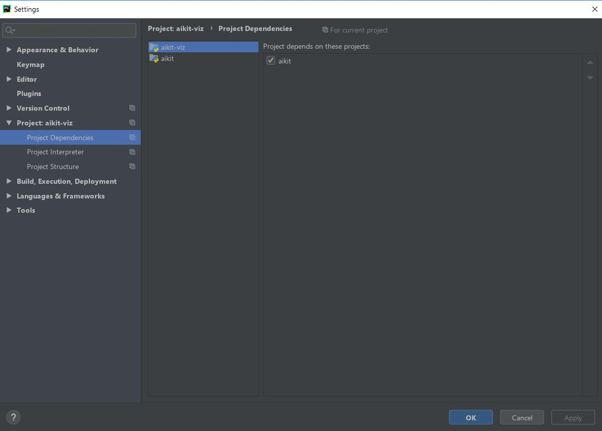
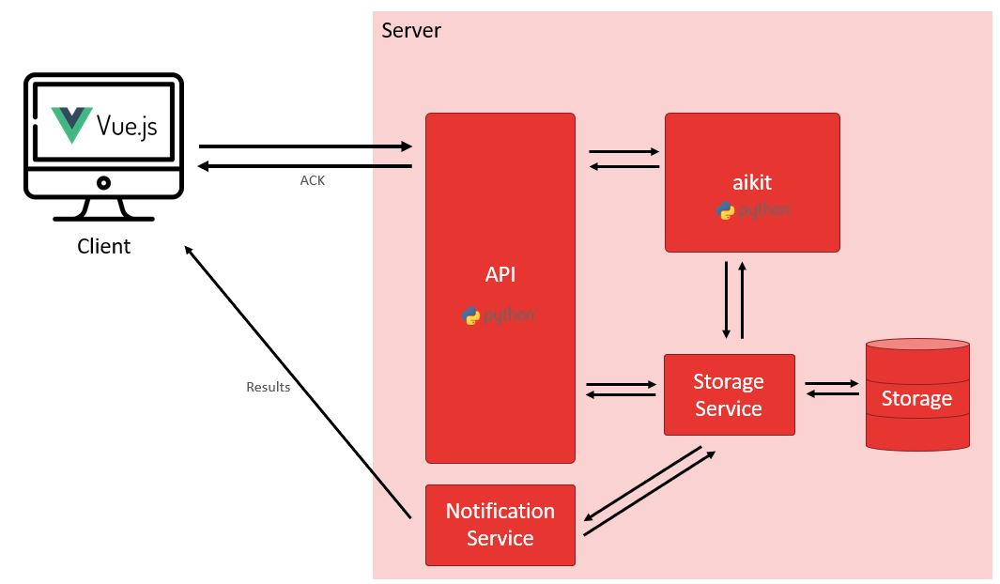
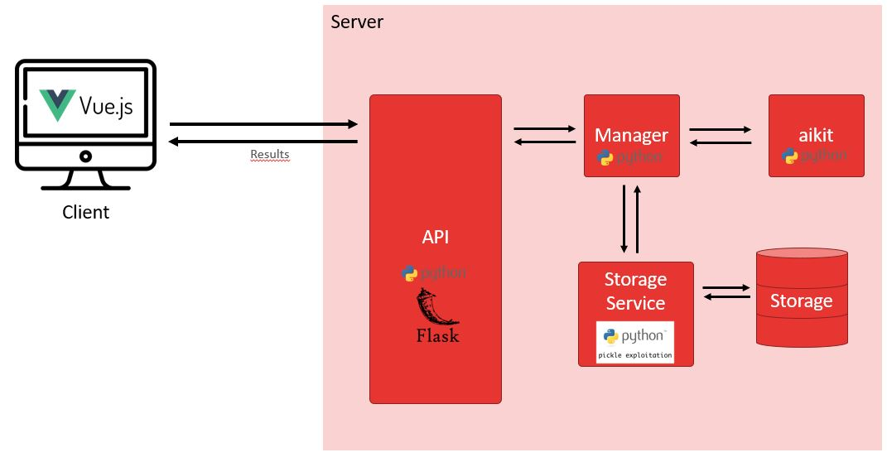
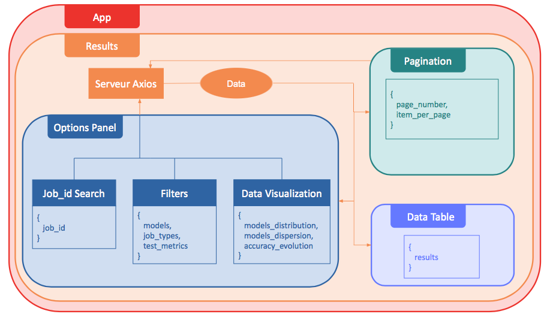

# README

This project is the development of a client that provides a GUI and API to visualize the automl results from aikit framework (https://sgithub.fr.world.socgen/sg-ai/aikit).


## Global
This project has been developed in order to improve data visualization of aikit results and aikit use. The goal is to propose the best possible user experience.

## Launch
The current solution supposes we already launch aikit run and we have a results folder.

### First installation

1. Copy dataset to the correct local folder
2. Install aikit and launch automl
3. Install aikit-viz
4. Launch aikit-viz server side
5. Launch aikit-viz client side


#### Copy dataset to the correct local folder
Copy the dataset from folder:
L:/datasets/public/datasets/
Paste in:
C:/Users/<your_id>/.aikit/datasets/titanic

#### Install aikit and launch automl
Follow [aikit documentation](https://aikit.readthedocs.io/en/latest/installation.html)

#### Install aikit-viz
Clone aikit-viz repository

Install requirements
It is possible that all the dependencies aren’t in the requirements file because we didn’t have the time at the end of the internship to try the requirements.
```bash
cd path/to/aikit-viz
pip install -r requirements.txt
```

Make aikit-viz depending on aikit projet.
With PyCharm IDE, you can open both projects in the same windows. Open the settings and select dependencies as shown bellow.




#### Launch server side
```bash
cd path/to/aikit-viz
python ./backend/api/app.py
```
You can open swagger to check that server is well running on https://localhost:5000

#### Launch aikit-viz client side
Be sure that npm is install. Then, you can run the client side.
```bash
cd path/to/aikit-viz/
npm run serve
```

Be sure that the server side is running to display the results.
You can open the GUI on https://localhost:8080

### JSON transmission formats
The configuration of the software bricks are important to allow dialogue between them. In addition to the routing seen in part

#### Server -> client
To be able to develop a web application from data retrieved from an API, it is necessary to know the format of the data transmitted by this API in order to be able to use them.
We have implemented the following JSON format:

```json
{
    "results": dict,
    "pagination": {
        "activePage": int,
        "totalPages": int,
        "pages": list,
        "items": {
            "itemsPerPage": int,
            "totalItems": int,
            "start": int,
            "end": int,
        }
    },
    "analysis": dict,
    "info": {
        "models": list,
        "job_types":
        {
            "models": list,
            "job_types": [
                "default",
                "block_search",
                "exploration",
                "guided",
            ],
            "metrics_fields": [
                "accuracy",
                "avg_roc_auc",
                "f1_macro",
                "log_loss_patched",
            ],
        }
    }
}
```

#### Client-> server
Created in the component Filters

```json
"filters": {
    "models": list,
    "job_types": list,
    "metrics": {
        "accuracy": float,
        "avg_roc_auc": float,
        "f1_macro": float,
        "log_loss_patched": float,
    }
}
```

## The architecture of aikit-viz

We worked on an optimal architecture in design. The architecture actually achieved is the first step in moving towards this studied architecture. We will then use the terms of designed architecture and effective architecture.

The designed architecture we studied and proposed is optimal to create the best possible user experience. Therefore, we choose to develop a thin-client web. The display of a GUI has to be fast to install and should not require any computing power. The whole project is designed for this purpose.
This is why we eventually proposed that aikit would be embedded on a remote server accessible from an RESTful API, which can be used by the client according to the following diagram:
 



### Designed Architecture
The Vue.js client will be able to communicate via the HTTP protocol with the server. The server will interpret the various requests via the API which itself will delegate the tasks to different services. Indeed, when a user wishes to launch the aikit automl, the client sends an authenticated request to the server, which responds with an access token. An instance of the aikit service -corresponding to the previously generated token - is then started. Simultaneously, an instance of a spy service, which is responsible for regularly retrieving the results, is launched. When the user wishes to retrieve the results of the analysis, the client sends an authenticated request to the server with the access token, the server therefore retrieves the results linked to the corresponding instance and sends them back in JSON format. The client can then display the results in a dedicated GUI.

### Effective Architecture
In order to meet the objective of creating a GUI, we have adapted this architecture to our solution throughout the internship. The architecture actually produced is articulated for the proper functioning of the client component as shown in figure 3 bellow:
 


#### Future development for the API
It may be interesting to carry out these points later as initially proposed:
token management,
notification service to communicate new results if aikit is running, 
a database management system.
This is broadly possible with the current solution since it was designed with the aim of easily adding modules and functionalities.

#### The web thin-client
The client is organized in composants as shown in the figure 4 bellow:




