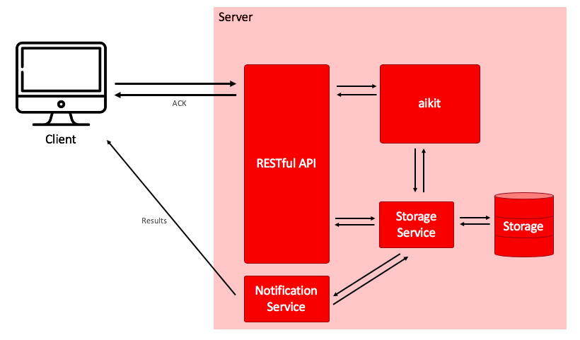

# documentation_aikit_internship
Documentation to improve aikit
(https://github.com/societe-generale/aikit)

## Presentation
Currently, aikit proposes an exel file to display automl results.
An interface could be realised for a better visualization.
Therefore, a RESTFULL API with flask in python will be created as following architecture to simplify the usage of aikit :

*Fig. 1: Architecture*

